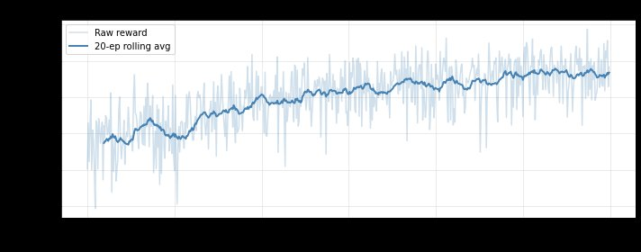
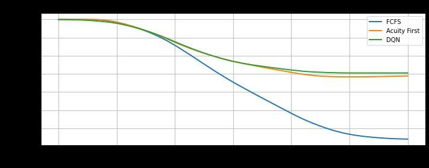
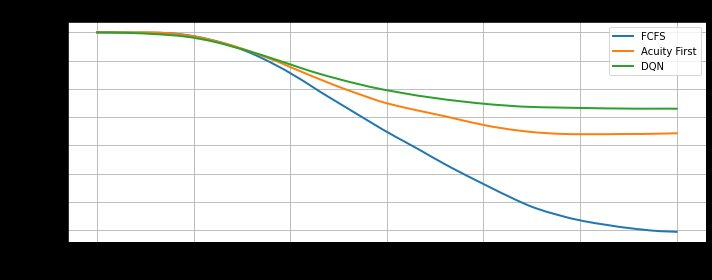
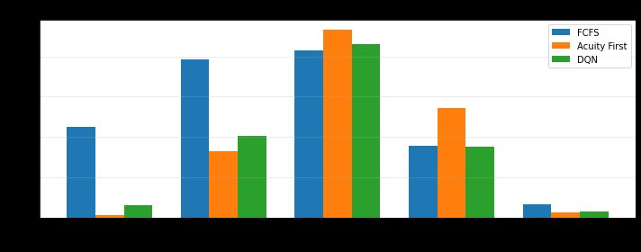
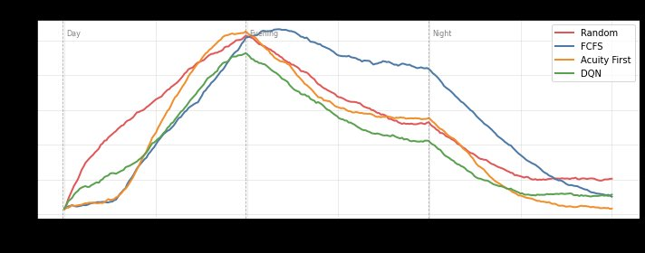

# Reinforcement Learning for Emergency Department Boarding

A Deep Q-Network that learns to manage patient boarding in a simulated emergency department, balancing clinical acuity, patient throughput, and bed utilization under uncertainty. The agent is trained and evaluated against three heuristic baselines in a custom [Gymnasium](https://gymnasium.farama.org/) environment grounded in real ED data from the MIMIC-IV-ED dataset.

📄 **[Read the full report (PDF)](DATA_780_Final_Report.pdf)** for the complete methodology, figures, and results.

## Overview

Emergency department (ED) **boarding** is the problem of allocating limited resources — trauma bays, main beds, and chairs — to a continuous stream of incoming patients. Each patient arrives with an Emergency Severity Index (ESI) from 1 (life-threatening) to 5 (non-urgent), and administrators must balance two competing goals: getting high-acuity patients seen immediately while keeping overall wait times reasonable for everyone.

Simple heuristics fall short. *First-come, first-served* ignores acuity and lets critical patients wait; *acuity first* never misses a critical case but lets lower-acuity patients languish. Both react to the present without anticipating future state. This project frames ED boarding as a **Markov Decision Process** and trains a **Double Deep Q-Network (DQN)** to learn a policy that anticipates how current admission decisions affect the department later in the day.

## Key Results

All four agents were evaluated over 100 independent 24-hour episodes on the same environment. Wait times are in simulation steps (1 step = 5 minutes).

| Agent | Total Reward | Mean Discharges | ESI 1 Max Wait | ESI 2 Max Wait |
|---|---|---|---|---|
| Random | −16,278 | 85.6 | 13.91 | 29.38 |
| FCFS | −16,479 | 95.8 | 12.93 | 24.62 |
| Acuity First | −7,775 | 81.9 | **0.66** | 11.89 |
| **DQN** | **−7,364** | 84.9 | 4.45 | 12.21 |

The DQN achieved the **best total reward of all four agents**. Rather than rigidly following a fixed ordering, it learned a mixed strategy: broadly prioritizing high-acuity patients while also responding to queue pressure and bed availability. It trades slightly longer ESI 1/2 waits for better overall throughput and a consistently shorter waiting-room queue — the offset that gives it the edge over the surprisingly strong Acuity First baseline.

### Training



*Per-episode reward (light) with a 20-episode rolling average (bold); x-axis is training episode, y-axis is total episode reward. The agent climbs from near-random performance toward a stable policy as epsilon decays. The persistent spread reflects the environment's stochasticity — a single episode with an unlucky burst of high-acuity arrivals scores far worse regardless of policy.*

### Agent Comparison

The DQN and Acuity First are closely matched, and the margin between them varies from one training run to the next because of the environment's randomness. The two plots below (each averaged over 50 runs, lower (less negative) is better) show this: in one run the policies track almost identically, while in another the DQN pulls clearly ahead.



*Cumulative reward over a 24-hour episode. Here the DQN (green) and Acuity First (orange) track closely; FCFS (blue) falls far behind as its acuity-blind admissions pile up penalties.*



*A separate training run in which the DQN (green) ends meaningfully ahead of Acuity First (orange). The run-to-run gap is itself a finding: the learned policy's advantage depends on training variance in a stochastic environment.*

### Where the DQN Wins and Loses



*Mean maximum wait time by ESI level (lower is better), comparing FCFS, Acuity First, and DQN across ESI 1–5. Acuity First is the clear winner for the most critical ESI 1/2 patients; the DQN occasionally lets a critical patient wait, indicating it did not fully internalize the guideline penalties for delaying critical care.*



*Mean waiting-room queue length across a 24-hour episode (x-axis is time of day). The DQN (green) holds the shortest queue through the busy evening peak, where Acuity First (orange) strands lower-acuity patients and FCFS (blue) backs up badly. This throughput and queue management is what earns the DQN its overall reward edge.*

## How It Works

### Simulation Environment (`ed_env.py`)
A custom Gymnasium MDP running in 5-minute steps, with 288 steps per 24-hour episode. Patient arrivals follow a time-varying **Poisson process** (busier during the day), ESI levels are drawn from the empirical MIMIC-IV-ED distribution, and treatment durations are sampled from a **log-normal distribution** calibrated to median length-of-stay by acuity. The ED has 28 beds across three zones: 2 trauma bays, 18 main beds, and 8 chairs (deliberately scarce, to make allocation non-trivial).

- **State** — a 65-dimensional vector: 20 patient slots × 3 features (ESI, normalized wait time, treatment duration), plus available beds per zone, plus a sine/cosine encoding of time-of-day so the model treats 11:45 PM and 12:00 AM as adjacent.
- **Action** — 21 discrete actions: do nothing, or admit one of 20 waiting patients. Slots are reserved per ESI level so high-acuity patients are never hidden behind long queues, with bed-type assignment rules (e.g., ESI 1/2 → trauma bay, falling back to a main bed).
- **Reward** — combines a discharge bonus, an admission incentive, acuity-weighted per-step wait penalties, clinical-guideline penalties for delaying critical patients, and a "left without being seen" (LWBS) penalty for abandoned patients.

### Agents
- **Baselines (`baselines.py`)** — Random, First-Come-First-Served, and Acuity First.
- **Double DQN (`dqn_agent.py`)** — a two-hidden-layer MLP (65 → 128 → 128 → 21) built in TensorFlow/Keras, with the techniques that make DQN stable:
  - **Experience replay** (50k-transition buffer) to break correlation between consecutive steps
  - **Double DQN** with separate online and target networks to reduce Q-value overestimation
  - **Huber loss** to handle large reward magnitudes without exploding gradients
  - **Epsilon-greedy exploration** decaying from 1.0 to 0.05 over training

## Repository Structure

| File | Description |
|---|---|
| `ed_env.py` | The Gymnasium ED simulation environment (state, action, reward logic) |
| `dqn_agent.py` | Double DQN agent: Q-network, replay buffer, and training step |
| `baselines.py` | Random, FCFS, and Acuity First baseline agents |
| `patient.py` | `Patient` dataclass and log-normal treatment-duration sampling |
| `final_demo.ipynb` | Trains the DQN, evaluates all four agents, and generates result figures |
| `midway_demo.ipynb` | Compares the three baseline agents |
| `dqn_weights.weights.h5` | Saved weights from a trained DQN (for evaluation without retraining) |
| `episode_rewards.npy` | Per-episode training rewards (used for the training curve) |
| `figures/` | Result figures used in this README |

## Setup

```bash
git clone https://github.com/elixf7/RL-for-ED-Boarding.git
cd RL-for-ED-Boarding
pip install -r requirements.txt
```

Requires Python 3.9+. Dependencies: `gymnasium`, `numpy`, `matplotlib`, `pandas`, and `tensorflow`.

## Usage

Open `final_demo.ipynb` to reproduce the full pipeline. The notebook will either train a fresh DQN or load the saved weights (`dqn_weights.weights.h5`), then evaluate all four agents and generate the comparison plots. `midway_demo.ipynb` runs the baseline-only comparison.

## Data Source

The simulation parameters — ESI acuity distribution, time-varying arrival rates, and length-of-stay by acuity — are extracted from the **MIMIC-IV-ED** dataset (~425,000 de-identified ED stays), via the MIMICEL event log (Wei et al., 2025) and the parameter analysis of Delos Reyes et al. (2024). No patient data is included in this repository; only published summary statistics are used to drive the simulator.

## Future Directions

- **Reward tuning** — the current weights were not exhaustively optimized; rebalancing the ESI 1/2 and LWBS penalties could help the agent more decisively beat Acuity First on critical wait times.
- **A richer environment** — adding staffing, specialized rooms, equipment limits, and mass-casualty events would make the simulation more realistic and likely widen the gap in RL's favor, since harder problems reward learned policies over fixed heuristics.

## References

1. Wei, J., et al. (2025). *Curation and Analysis of MIMICEL — An Event Log for MIMIC-IV Emergency Department.* arXiv:2505.19389.
2. Delos Reyes, R., Capurro, D., & Geard, N. (2024). *Modelling patient trajectories in emergency department simulations using retrospective patient cohorts.* Computers in Biology and Medicine, 182, 109147.
3. Lee, S., & Lee, Y. H. (2020). *Improving emergency department efficiency by patient scheduling using deep reinforcement learning.* Healthcare, 8(2), 77.
4. Li, Y., et al. (2024). *Deep Reinforcement Learning for Efficient and Fair Allocation of Healthcare Resources.* arXiv:2309.08560.
